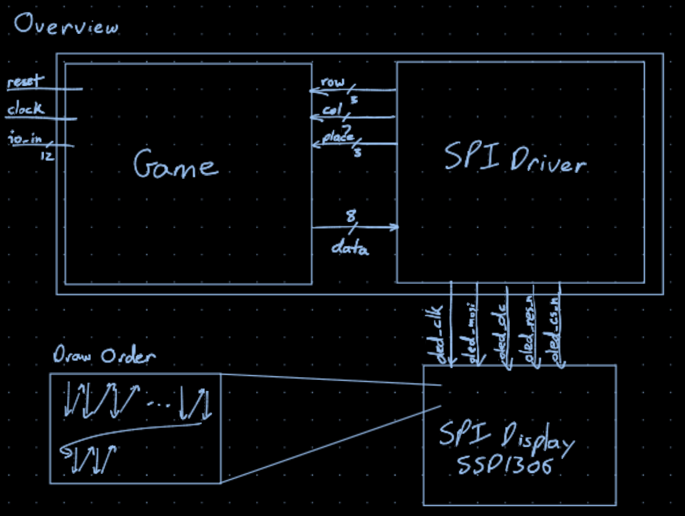
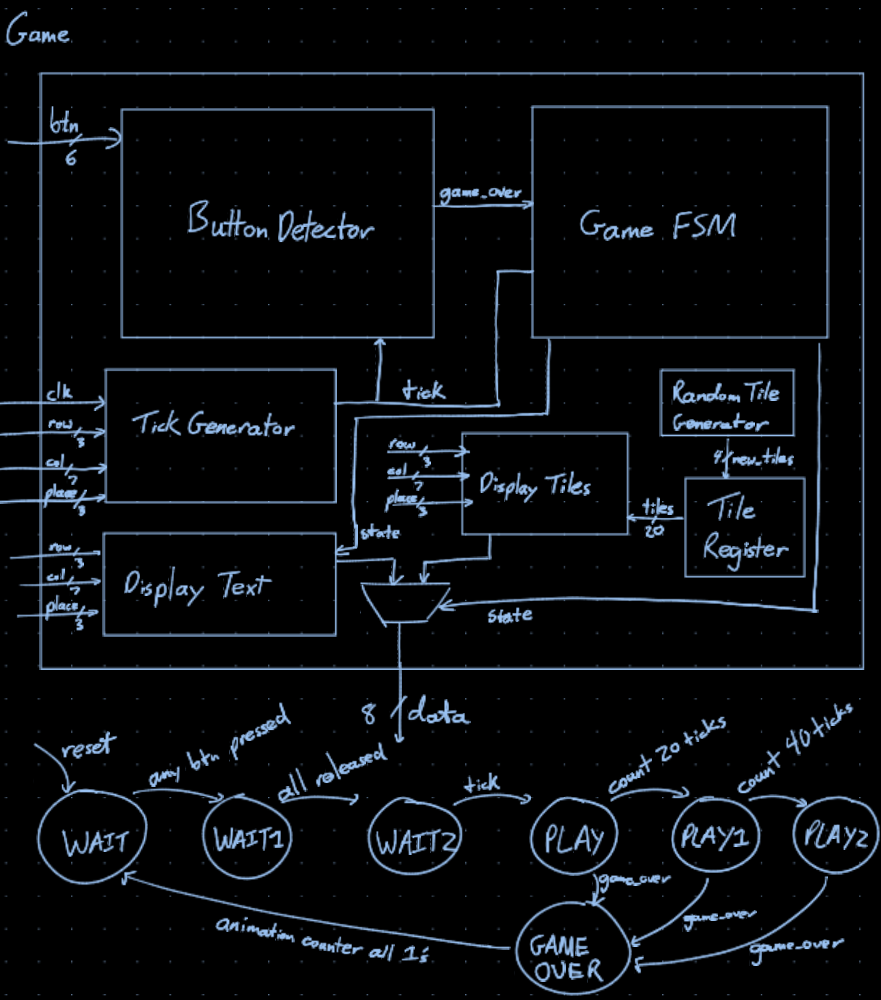
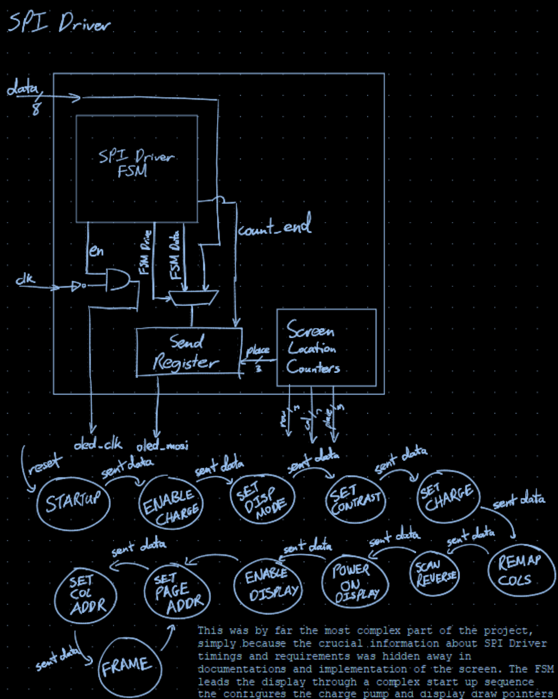
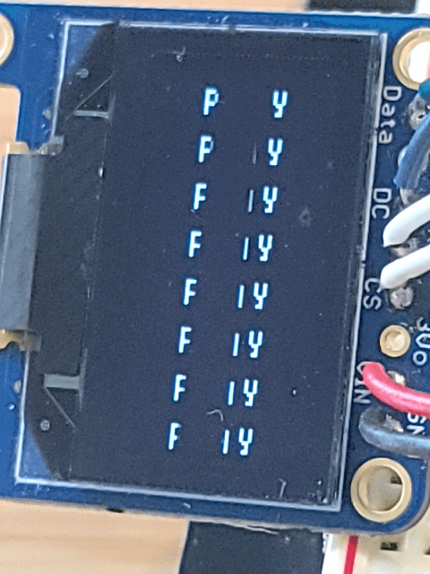
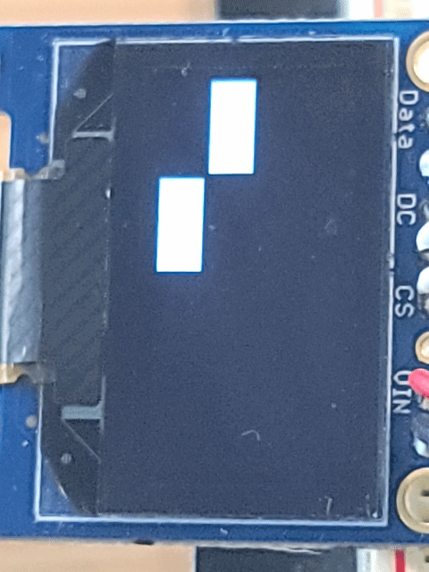
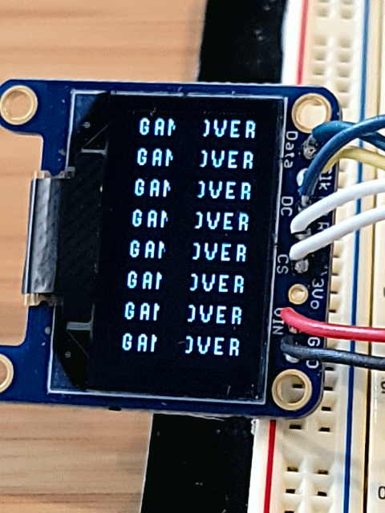

# PianoTiles18224

Spencer Li
18-224 Spring 2024 Final Tapeout Project

## Overview
Piano Tiles implementation for a small battery powered chip design. This is meant to be a toy similar to early handheld gaming devices. 

## How it Works
The design interfaces with a small SSD1306 SPI OLED display and 4 buttons for inputs. In order to drive these, the chip has a small SPI driver implemented on board that outputs the data from the game. Data is taken from the game hardware thread and used to drive the spi display driver hardware thread after it has initialized the screen. 

This is the basic schematic overview of the design on the chip. The Game component communicates with the SPI Driver in order to correctly output data to the screen. Much of the complexity of this project has to due with managing the oddities of the display. This specific screen has a really strange draw order, so it has to draw down 8 bits and then across 128 columns and then down for 8 rows. This means that the Game components needs to output in a slightly different way than a VGA driver would. It instead outputs 8 bits at a time and has the SPI driver clock through them when outputting them to the SPI Display. This display also has a set of commands required to turn on and config the display to be useful. After all of the config commands have been sent, the FSM switches to inputs from the Game component.

The Game is made up of an FSM for the different states of playing the game. And various components to generate, manage, and click tiles. These include the LFSR to generate the random numbers, the shift register to manage the state of the tiles and the Button Detector to check if the right buttons are pressed. 
The WAIT states are to make sure that no buttons are pressed at the start of the game so that the player doesn't instantly lose. PLAY, PLAY1 and PLAY2 are states where the player is pressed tiles, with PLAY1 and PLAY2 being faster states. If the player misses a tile or miss-clicks they are sent to the GAMEOVER state and allowed to play again once the animation is done playing. 

This was by far the most complex part of the project, simply because the crucial information about SPI Driver timings and requirements was hidden away in documentations and implementation of the screen. The FSM leads the display through a complex start up sequence the configures the charge pump and display draw pointers among other things. Once it has been fully configured the display is able to take data from the Game component and send it with the SPI protocal to the screen. 

### The SPI Display Starting Sequence:

Each of these commands corresponds to a state in the SPI FSM

8D 14 		Enable Charge Pump
20 00 		Set Display Mode to Horizontal (means display pointer will wrap)
81 CF		Set Contrast
D9 F1		Configure Charge Pump
A1    		Reverse the mapping of columns (flip the screen horizontally)
C8		    Reverse COM output mapping (flip the draw direction vertically)
A4		    Power On Display
AF		    Enable Display
22 00 FF	Set Page Address to go from 00 to FF
21 00 7F	Set Column Address to go from 00 to 7F

Then it goes into FRAME mode which will take data from the Game Component and display it through to the screen using the MOSI pin. 

### Linear Feedback Shift Register Random Number Generator
The shift register is a 24 bit register with the feedback function  x^24 + x^23 + x^22 + x^17 + 1, which was also augmented with button presses from the player in order to make it more random. 

The values from the LFSR were taken and mixed, XORing random bits of the register together to get 8 bits of random and then ANDing pairs of those to get 4 total bits of random with a good spread of 1's and 0's. 

### Game Play

The game loads into a nice flashing play screen where you can press any button to start. 

Once a button is pressed you enter the game. Tiles will drop from the top and you need to press buttons when they reach the button in order to clear them. Tiles are generated using a 24 bit Linear Feedback Shift Register (LFSR) of the polynomial x^24 + x^23 + x^22 + x^17 + 1 which was the one with the longest period on wikipedia. 

If you lose, you get sent to a Game Over animation.

After a short duration you are sent back to the play screen to play again.

## Inputs/Outputs
### Inputs: 
- 5 Left Most Button
- 3 Left Center Button
- 1 Right Center Button
- 0 Right Most Button
- 2 General Start Button
- 4 General Start Button
### Outputs:
- 11 SPI clock for OLED SSD1306 Screen (clk)
- 10 SPI Master In Slave Out (mosi)
- 9 SPI Data/Command Selector (dc)
- 8 SPI Display Reset Low (res_n)
- 7 SPI Chip Select Low (cs_n)

## Hardware Peripherals
This design needs at least 4 buttons to work (2 and 4 need to pulled low if not in use) and a SSD1306 OLED Display

## Design Testing
Design testing was done with cocoTB and invidual test benches for the game, spi driver, pseudo random number generator, and the completed chip. These can all be run using the rudimentary build system made for this project with `./build {main|game|spi|random}` to test each of these parts. `./build` on its own would take the completed design and upload it to a connected FPGA for hardware in the loop testing. 

The most rigourous testing happens with the SPI Driver to make sure that the startup sequence is correct. The others also have tests that display the output in software for easier debugging and access to the dump.vcd for waveform viewing. `./build main` actually gives an ascii representation of the first frame of data to make sure that it passes a visual check.

## Bringup
In order to check that outputs are correct you will need a Digital Logic Analyzer. The most important parts to check are the spi initialization bytes. If this doesn't work than the screen will not turn on. As long as this is correct, the rest of the game should just work.
From here you need to attach the screen and the buttons to the screen. The screen needs a seperate 3.3V power supply, but the logic of the SPI Driver should be enough to drive the OLED part of the display. This should hopefully bring up the nice screen with the flashing PLAY text and you should be able to play.

## Media
I have a lot of media in the form of videos which are a bit too hefty to upload to github. (These have been uploaded to canvas.)

## Bring Up and Final Touches
Once the chip comes back from the foundry, it will be tested to see if it works. If it does then a 3d printed chassis will be made for it that holds the screen, battery and buttons. This finalizes the product allowing it to be brought anywhere to satisfy my boredom.

